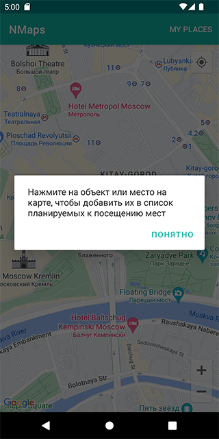
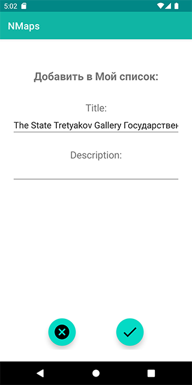
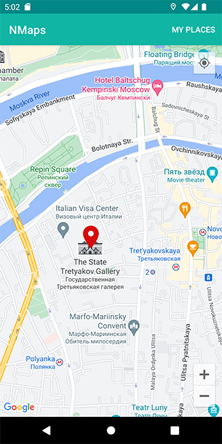
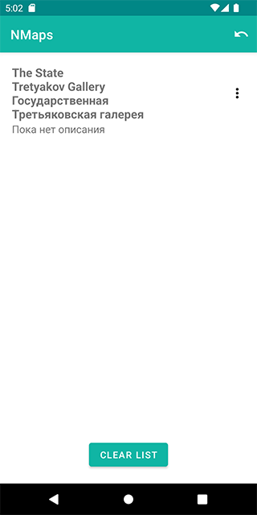

#NMaps
The app is designed for travellers and based on Google Maps.

The user can click on the map and create a marker with a description in place of the click.

All points are stored on the device so that later the user can come to the city and quickly navigate through the map which sights he wanted to see.

The application supports:
1. Creating a point (marker).
2. Edit the point (marker).
3. Deleting a point (marker).
4. View all points on a separate screen: the user clicks on an existing point and goes to it on the map.

The application specifically uses Snackbar instead of AlertDialog for training purposes.

Stack: Kotlin, XML, Google Maps, Room

Screenshots:
 
 